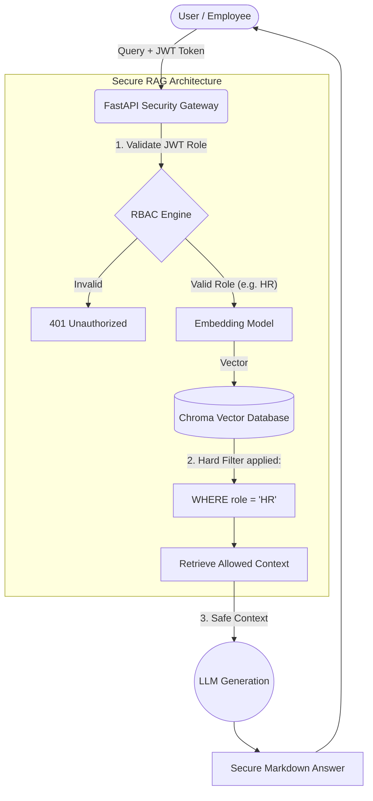

# Secure Enterprise RAG Architecture 🛡️

[](https://secure-enterprise-rag-1.onrender.com)


### 🔴 [Live Demo: Secure Enterprise RAG UI](https://secure-enterprise-rag-1.onrender.com)

A production-grade **Retrieval-Augmented Generation (RAG)** API designed with **Zero-Trust Security** and **Role-Based Access Control (RBAC)**. This architecture prevents Large Language Models (LLMs) from leaking sensitive enterprise data (e.g., HR salaries, Engineering passwords) to unauthorized users by enforcing cryptographic hard-filters at the Vector Database level.

## 🌟 The Problem it Solves
Standard RAG systems connect an LLM to a unified Vector Database, meaning any user can query any document. If an intern asks a standard RAG system for the CEO's salary, the AI will confidently expose it. 

This project solves this by wrapping the Vector Database in a secure JWT-authenticated API that intercepts the query and injects cryptographic role-metadata filtering.

## 🏗️ Architecture Diagram



## 🚀 Features
* **Zero-Trust Vector Retrieval:** Documents are tagged with security metadata upon ingestion. The API physically blocks unauthorized retrieval using ChromaDB's `$or` filters.
* **JWT Authentication:** Cryptographically signed tokens prove the user's role (`HR_Manager`, `Software_Engineer`, etc.).
* **Real-time Markdown Rendering:** The React frontend parses AI outputs using `react-markdown` for a premium, ChatGPT-like user experience.
* **Dockerized:** Fully containerized microservice ready for HuggingFace Spaces, Render, or Google Cloud Run.
* **FastAPI Backend:** High performance asynchronous Python API.

## 🛠️ Tech Stack
* **Framework:** FastAPI, Uvicorn, React, Vite
* **Security:** PyJWT, hashlib
* **AI/ML:** LangChain, HuggingFace SentenceTransformers (`all-MiniLM-L6-v2`)
* **Vector DB:** ChromaDB
* **DevSecOps:** Docker, Docker Compose

## 🚀 Quick Start

### 1. Run the Full Stack with Docker (Recommended)
You can launch the FastAPI Backend and the React Frontend simultaneously using Docker Compose.
```bash
# Clone the repository
git clone https://github.com/Vamshi868876/Secure-Enterprise-RAG.git
cd Secure-Enterprise-RAG

# Launch the entire architecture
docker-compose up --build
```
* The API will run on `http://localhost:8000`
* The React Chat UI will run on `http://localhost:5173`

### 2. Local Python & Node.js Setup
If you prefer running without Docker:
```bash
# Terminal 1: Run the Backend
python -m venv venv
venv\Scripts\activate
pip install -r requirements.txt
python populate_db.py
uvicorn main:app --reload

# Terminal 2: Run the React Frontend
cd frontend
npm install
npm run dev
```

## ☁️ Free Deployment Guide (No AWS/Azure Required)

This repository is optimized for deployment on free platforms, making it an excellent AI/ML portfolio piece!

### Deploy Backend to Render (Free Tier)
1. Sign up at [Render.com](https://render.com/).
2. Create a **New Web Service** and link this GitHub repository.
3. Render will automatically detect the `Dockerfile` and build the Python API container.
4. Copy the resulting backend URL.

### Deploy Frontend to Render (Free Tier)
1. In `frontend/src/App.jsx`, update the `API_URL` to point to your new Render backend URL.
2. Go to Render and create a **New Static Site**.
3. Point it to this repository, but set the **Root Directory** to `frontend`.
4. Set the Build Command to `npm run build` and Publish directory to `dist`.

*Alternatively, the backend can be deployed for free on **HuggingFace Spaces (Docker)** which provides 16GB of free RAM, perfect for ML models!*

## 🧪 Security Simulation (Hacker Test)

To prove the security works, open the React UI (`http://localhost:5173`) and test the two different JWT roles.

1. ❌ **Login as Software Engineer:** Attempt to ask "What is the CEO's salary?". The system mathematically blocks access to the HR documents at the Vector level. The AI is completely unaware of the salary.
2. ✅ **Login as HR Manager:** Ask the exact same question. The system verifies the role, unlocks access to the HR documents, and securely outputs the correct $850,000 salary with proper markdown formatting.

---

## 👨‍💻 Author
**Developed by:** Vamshi Batthula  
**Contact:** [batthulavamshi740@gmail.com](mailto:batthulavamshi740@gmail.com)

*Built as a demonstration of Secure Enterprise AI Architecture.*
